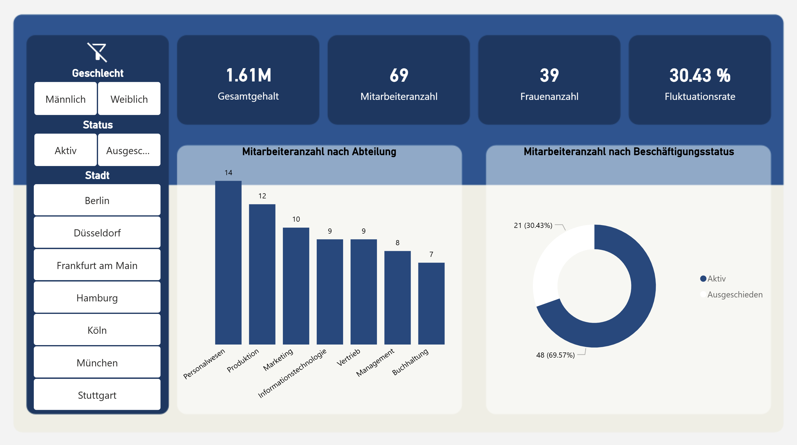

# 📖 **Dil:** [Deutsch](README.md) | **Türkçe**

# 👥 İK Analiz Panosu

Bu proje, kurgusal bir şirkete ait İK verilerini görselleştiren ve analiz eden interaktif bir Power BI panosudur. Projenin amacı; departman ve istihdam durumuna göre çalışan dağılımı, çalışan demografik profili ile toplam maaş, çalışan sayısı, kadın oranı ve işten çıkış oranı gibi temel metrikler üzerine içgörüler elde etmektir. Pano, tutarlı bir mavi renk şemasıyla tasarlanmış olup cinsiyet, durum ve şehir gibi interaktif filtreler sayesinde sezgisel bir kullanım sunmaktadır.

## 📸 Ekran Görüntüsü

## 🛠️ Kullanılan Araçlar

- **Power BI Desktop**
- **DAX**
- **Power Query**
- **Google Slides**

## 📧 İletişim

**Süha Çağrı Özbakışlar**

